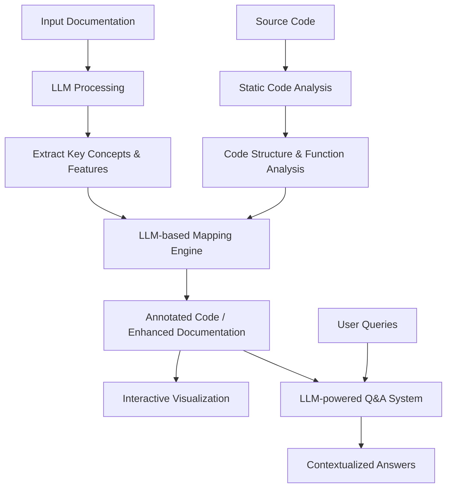

# Visocore - VIsualize SOurce COde REpositories

**Visocore** is a source code visualization and analysis tool designed to bridge the gap between high-level documentation and the actual codebase. By combining advanced static code analysis with documentation awareness and providing intuitive visualization, Visocore helps users quickly orient themselves within a large or poorly documented codebase, making it easier to debug, extend, or maintain complex projects.

---

## Key Features

- **Code Structure Mapping**: Visocore automatically generates maps that visually represent the relationships between various code components (classes, functions, modules, etc.).
- **Documentation Integration**: Uses LLM (Large Language Model) processing to ingest user documentation (such as README files and user guides), allowing it to cross-reference documentation with the actual code.
- **Q&A System**: Allows users to ask questions about the codebase and receive contextualized answers based on code structure and documentation.
- **Discovery & Targeted Analysis Modes**: Users can explore the entire codebase or focus on specific areas of interest, depending on their use case.
  - *Discovery Mode*: Ideal for new users who want to explore how different parts of the codebase interact.
  - *Targeted Analysis Mode*: Designed for users with specific knowledge or goals, such as debugging a specific feature or understanding a particular module.
- **Concept Boosting**: Users can provide key concepts for boosting in searches or analysis, guiding Visocore to emphasize terms that matter most for their task.

---
## Architecture Overview


---

## Why Visocore?

While many tools exist for code visualization, static analysis, and documentation generation, Visocore brings together the best of all worlds to solve real-world problems that developers face when navigating complex or poorly documented repositories.

### Example Use Cases
- **Navigating Large Codebases**: Developers new to a project can quickly understand the core structure and locate important features, even in poorly documented repositories.
- **Feature Development**: When adding a new feature, Visocore helps developers identify where similar functionality resides, making it easier to extend existing code.
- **Debugging**: Developers can provide Visocore with symptoms or key concepts related to a bug (e.g., "timeout handling"), and the tool will direct them to relevant areas of the code.
- **Code Review Preparation**: Visocore’s visual map provides an at-a-glance summary of the key components and relationships in the code, making it easier to prepare for code reviews.

### How Visocore Differs

**Code Visualization Tools:**

- **CodeSee**: Generates interactive maps of codebases, showing relationships between files and functions.
- **Source Trail**: An open-source tool for interactive source code exploration.
- **Code Map (Visual Studio feature)**: Provides a zoomable map of code files and their relationships.

**Where Visocore Adds Value**: These tools often focus on file-level or function-level visualization, but Visocore integrates documentation analysis and query-based exploration to provide richer context and faster onboarding.

**Static Analysis Tools:**

- **Understand**: Offers comprehensive code analysis and visualization for multiple languages.
- **SciTools**: Provides various code comprehension tools, including dependency graphs.

**Where Visocore Adds Value**: Visocore extends beyond code analysis by blending structural mapping with interactive Q&A and allowing users to tailor exploration based on their goals.

**Documentation Generators:**

- **Doxygen**: Generates documentation from source code, including call graphs and collaboration diagrams.
- **JSDoc (for JavaScript)**: Can generate documentation with interconnections between functions and modules.

**Where Visocore Adds Value**: Unlike traditional documentation generators, Visocore cross-references user documentation with code and allows users to interactively query the combined knowledge of both.

**IDE Features:**

- Modern IDEs like IntelliJ IDEA, Visual Studio Code, and Eclipse provide basic code navigation features like “Go to Definition” and “Find Usages.”

**Where Visocore Adds Value**: Visocore's deep code structure mapping and discovery modes offer a more holistic and interactive experience than traditional IDE navigation, especially when documentation is lacking or scattered.

**Graph Visualization Tools:**

- **Sourcetrail**: An open-source cross-platform source explorer that helps users get productive on unfamiliar source code.

**Where Visocore Adds Value**: Sourcetrail focuses on structural graphs, but Visocore enriches these visualizations with documentation-aware searching, Q&A features, and user-driven concept boosting.

**Repository Analysis Tools:**

- **GitHub’s Dependency Graph Feature**: Shows dependencies for many popular languages directly on GitHub.
- **GitPrime (Pluralsight Flow)**: Provides analytics and visualizations of development workflows and code interactions.

**Where Visocore Adds Value**: Visocore offers more granular insights into code structure and lets users go beyond workflow metrics, focusing instead on what’s most relevant to their code comprehension tasks.

---
## Installation

```bash
# Clone the repository
git clone https://github.com/your-username/visocore.git

# Install dependencies
cd visocore
pip install -r requirements.txt
```

---

## Usage

To run Visocore and start exploring a codebase:

```bash
python visocore.py /path/or/url/to/repository
```

Visocore will analyze the code and generate a visual map with the context of knowledge gleaned from the README (other documentation support coming soon.). You can interact with the map through TBD.

---

## Roadmap

- **MVP Release**: Focus on core code analysis and structure mapping.
- **Interactive UI**: Introduce an intuitive GUI for visual code exploration.
- **Enhanced Q&A**: Refine the Q&A system to provide even more contextualized answers.
- **Plugin Ecosystem**: Build out plugin support for additional languages and frameworks.
- **IDE Integration**: Offer plugins for popular IDEs like Visual Studio Code and IntelliJ IDEA.
- **Community Feedback**: Incorporate feedback from early users to refine features and improve the user experience.

---

## Contributing

Contributions are welcome! Feel free to submit issues or pull requests on GitHub.

---

## License

Visocore is released under the [MIT License](LICENSE).
